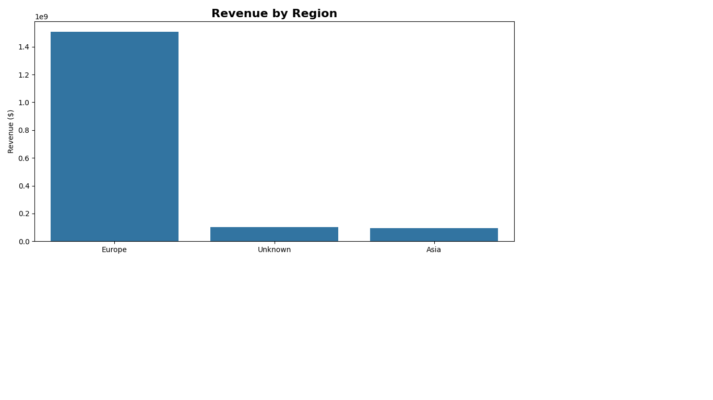
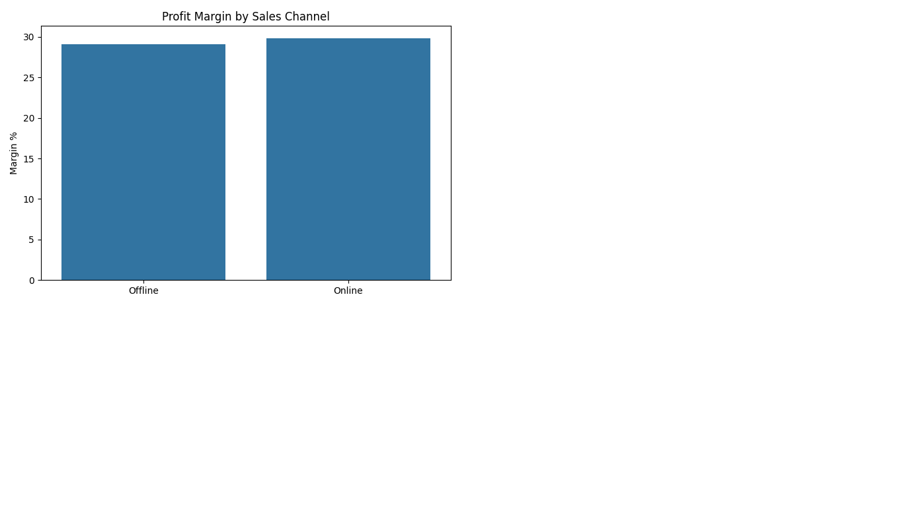
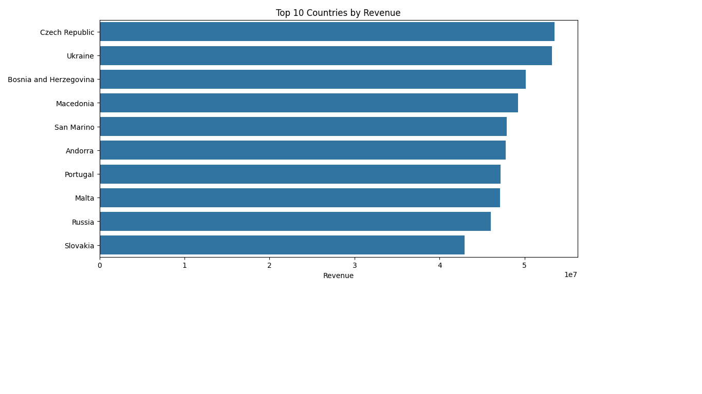

# Global Sales Analysis

## Overview

This project analyzes historical global sales data using Python, Pandas, and data visualization techniques.

The objective was to clean raw datasets, merge multiple tables, generate KPIs, and identify business insights related to revenue, profitability, geography, logistics, and sales channels.

---

## Tools Used

- Python
- Pandas
- NumPy
- Matplotlib
- Seaborn
- Google Colab

---

## Key Insights

- Europe was the leading revenue region.
- Office Supplies generated the highest revenue.
- Cosmetics achieved the highest profit.
- Online sales showed slightly better margins than Offline.
- Revenue declined after 2014.
- Monday was the strongest sales day.

---

## Sample Visualizations

### Revenue by Region

### Sales Channel Performance

### Country Revenue

---

## Author

Fernando
